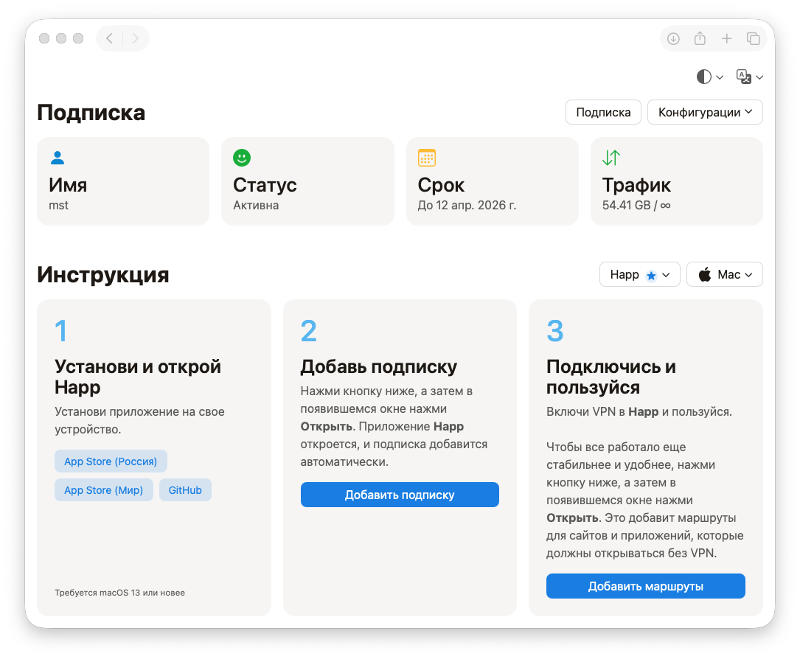

# Marzbanify Omni

<p align="center">
 <a href="./README_EN.md">English version</a>
  <br><br>
  <b>Marzbanify Omni</b> — это форк <a href="https://github.com/dermv/marzbanify-template">Marzbanify Template</a>.
  <br><br>
  Простой, красивый и удобный HTML-шаблон страницы подписки для <a href="https://github.com/Gozargah/Marzban">Marzban</a> и <a href="https://github.com/PasarGuard/panel">PasarGuard</a>.
  <br><br>
  <a href="#why-this-fork-exists">Зачем был сделан этот форк</a>
  ·
  <a href="#what-changed-in-this-fork">Что изменено в этом форке</a>
  <br>
  <a href="#install">Установка</a>
  ·
  <a href="#customization">Настройка</a>
  ·
  <a href="#reference">Справка</a>
</p>

<p>
  <picture>
    <source media="(prefers-color-scheme: dark)" srcset="./screenshots/dark_ru.png">
    <source media="(prefers-color-scheme: light)" srcset="./screenshots/light_ru.png">
    
  </picture>
</p>

<a id="why-this-fork-exists"></a>
## Зачем был сделан этот форк
Изначальные шаблоны были построены вокруг узкого сценария подключения через Hiddify. Этот форк был создан для того, чтобы сохранить лёгкий подход к шаблонам, но при этом дать пользователям выбор **операционной системы + клиентского приложения**, используя современные и активно поддерживаемые клиенты, вместо Hiddify, который больше не обновляется. **Happ** теперь является рекомендуемым клиентом по умолчанию для всех устройств, поэтому в интерфейсе он помечен звёздочкой. Так же сделана отдельная адаптированная версия для PasarGuard.

## Обзор

Поддерживаемые панели:

- `Marzban`
- `PasarGuard`

Для каждой линейки есть две версии страницы:

- `index.html` — полная версия с блоком информации о подписке
- `mini/index.html` — компактная версия без блока информации о подписке

Поддерживаемые локализации:

- русская
- английская

<a id="what-changed-in-this-fork"></a>
## Что изменено в этом форке

По сравнению с исходным [**Marzbanify Template**](https://github.com/dermv/marzbanify-template), этот форк сейчас включает следующие фактические изменения:

- Страница теперь содержит две версии: для панели Marzban и панели PasarGuard.
- Страница теперь поддерживает выбор клиентского приложения и показывает инструкции по подключению, соответствующие выбранному приложению и платформе.
- Набор поддерживаемых ОС теперь включает: `iOS`, `Android`, `Mac`, `Windows`, `Linux`.
- В новых вариантах сейчас используются следующие клиенты: `Happ`, `Incy`, `Shadowrocket`, `v2rayN`, `v2rayNG`, `Clash`, `Clash Meta`, `Outline`, `Sing-Box`.
- Шаблоны были обновлены: добавлены новые секции инструкции, действия для подписки и конфигов, а также QR-коды не только для подписок, но и для конфигураций, поддерживаемых Marzban или PasarGuard, вместе с более новой структурой шапки и меню.
- Для **Happ** и **Incy** была добавлена возможность локального роутинга на устройстве через JSON-источники [**RoscomVPN**](https://github.com/hydraponique/roscomvpn-routing).
- Новые варианты интерфейса сейчас предоставляют две локали: **русскую** и **английскую**.
- Для PasarGuard: доступно копирование конфигураций со страницы подписки для поддерживаемых клиентов: `Clash`, `Clash Meta`, `Outline`, `Sing-Box`, `Xray`. Причем отображение клиентов зависит от настроек панели: если ручные конфигурации отключены - они будут скрыты и на странице подписки.

## Поддерживаемые переменные

### Marzban

Шаблон использует следующие значения, которые должны быть подставлены панелью:

- `{{ user.links }}`
- `{{ user.status.value }}`
- `{{ user.username }}`
- `{{ user.expire | datetime }}`
- `{{ user.used_traffic | bytesformat }}`
- `{{ user.used_traffic }}`
- `{{ user.data_limit | bytesformat }}`
- `{{ user.data_limit }}`
- `{{ user.data_limit_reset_strategy.value }}`

Мини-версия не использует поля сводной информации о пользователе. Из панели ей нужен только список конфигов:

- `{{ user.links }}`

### PasarGuard

Полная версия использует те же плейсхолдеры сводной информации:

- `{{ user.status.value }}`
- `{{ user.username }}`
- `{{ user.expire | datetime }}`
- `{{ user.used_traffic | bytesformat }}`
- `{{ user.used_traffic }}`
- `{{ user.data_limit | bytesformat }}`
- `{{ user.data_limit }}`
- `{{ user.data_limit_reset_strategy.value }}`

Кроме этого, шаблон ожидает, что текущий URL страницы имеет вид:

- `/sub/<token>`

От этого URL шаблон строит дочерние endpoints:

- `/sub/<token>/links`
- `/sub/<token>/xray`
- `/sub/<token>/clash`
- `/sub/<token>/clash_meta`
- `/sub/<token>/outline`
- `/sub/<token>/sing_box`

Мини-версия не использует плейсхолдеры сводной информации о пользователе, но использует тот же URL-контракт:

- `/sub/<token>`
- `/sub/<token>/links`
- `/sub/<token>/xray`
- `/sub/<token>/clash`
- `/sub/<token>/clash_meta`
- `/sub/<token>/outline`
- `/sub/<token>/sing_box`

<a id="customization"></a>
## Безопасная настройка

Ниже перечислены точки настройки, которые реально есть в текущих HTML-файлах и которые можно менять без изменения архитектуры страницы.

### Можно безопасно редактировать

- `DEFAULT_THEME`
  Тема по умолчанию: `system`, `light` или `dark`.

- `META_THEME_COLORS`
  Цвета `theme-color` для светлой и темной темы.

- `SUBSCRIPTION_NAME`
  Название, которое используется в части deep link-схем клиентов.

- `ROUTING_PROFILE_URLS`
  URL удаленных routing-профилей для `Happ` и `Incy`.

- `ROUTING_PROFILE_FALLBACK_JSON`
  Встроенные fallback-профили роутинга, если удаленный JSON недоступен.

- `GUIDE_APPS`
  Основная конфигурация гайдов:
  доступные платформы, список клиентов, `defaultApp`, `recommended`, `minOs`, кнопки установки, deep link, routing link, а для PasarGuard еще и `configFormat`.

- `GUIDE_COPY`
  Тексты шагов инструкции для обеих локалей.

- `MESSAGES`
  Интерфейсные тексты, подписи кнопок, тексты модального окна и локализация.

- `PASARGUARD_DOWNLOAD_FILENAMES`
  Только значения имен файлов для скачивания в шаблонах PasarGuard. Ключи форматов менять не нужно.

### Что можно менять, но аккуратно

- URL магазинов приложений и GitHub-релизов внутри `GUIDE_APPS`
- Подписи кнопок установки
- Тексты локализации в `GUIDE_COPY` и `MESSAGES`

Если вы меняете эти значения, сохраняйте существующую структуру объектов и набор ключей.

## Что не стоит редактировать

### Не редактируйте без необходимости

- Jinja-плейсхолдеры панели:
  `{{ ... }}` и ``

- Контракт PasarGuard по URL:
  `/sub/<token>`, `/links`, `/xray`, `/clash`, `/clash_meta`, `/outline`, `/sing_box`

- Ключи форматов PasarGuard:
  `xray`, `clash`, `clash_meta`, `outline`, `sing_box`

- `id`, `data-*`, классы и DOM-структуру, на которые опирается JavaScript

- Логику, которая читает `window.location.href`, `localStorage`, кэш routing-профилей и значения, приходящие из панели

### Почему это важно

В текущей реализации JS завязан на конкретные `id`, `data-guide-platform`, `data-theme-val`, `data-locale`, шаблонные значения панели и предсказуемую структуру меню/модального окна. Переименование этих элементов без синхронной правки JS может сломать:

- переключение языка и темы
- меню платформ и клиентов
- генерацию deep link
- QR-модальное окно
- загрузку конфигов
- routing profiles

<a id="install"></a>
## Установка для Marzban

### 1. Скопируйте файл в каталог шаблонов Marzban

Пример для полной версии:

```bash
sudo wget -O /var/lib/marzban/templates/subscription/index.html https://raw.githubusercontent.com/mrkstnn/marzbanify-omni/main/Marzban/index.html
```

Пример для mini-версии:

```bash
sudo wget -O /var/lib/marzban/templates/subscription/index.html https://raw.githubusercontent.com/mrkstnn/marzbanify-omni/main/Marzban/mini/index.html
```

### 3. Укажите путь к шаблону в конфигурации Marzban

В репозитории для этого используются такие переменные:

```bash
CUSTOM_TEMPLATES_DIRECTORY="/var/lib/marzban/templates/"
SUBSCRIPTION_PAGE_TEMPLATE="subscription/index.html"
```

Пример добавления в `/opt/marzban/.env`:

```bash
echo 'CUSTOM_TEMPLATES_DIRECTORY="/var/lib/marzban/templates/"' | sudo tee -a /opt/marzban/.env
echo 'SUBSCRIPTION_PAGE_TEMPLATE="subscription/index.html"' | sudo tee -a /opt/marzban/.env
```

### 4. Перезапустите Marzban

```bash
marzban restart
```

## Установка для PasarGuard

### 1. Скопируйте файл в каталог шаблонов PasarGuard

Пример для полной версии:

```bash
sudo wget -O /var/lib/pasarguard/templates/subscription/index.html https://raw.githubusercontent.com/mrkstnn/marzbanify-omni/main/PasarGuard/index.html
```

Пример для mini-версии:

```bash
sudo wget -O /var/lib/pasarguard/templates/subscription/index.html https://raw.githubusercontent.com/mrkstnn/marzbanify-omni/main/PasarGuard/mini/index.html
```

### 3. Укажите путь к шаблону в конфигурации PasarGuard

В репозитории для этого используются такие переменные:

```bash
CUSTOM_TEMPLATES_DIRECTORY="/var/lib/pasarguard/templates/"
SUBSCRIPTION_PAGE_TEMPLATE="subscription/index.html"
```

Пример добавления в `/opt/pasarguard/.env`:

```bash
echo 'CUSTOM_TEMPLATES_DIRECTORY="/var/lib/pasarguard/templates/"' | sudo tee -a /opt/pasarguard/.env
echo 'SUBSCRIPTION_PAGE_TEMPLATE="subscription/index.html"' | sudo tee -a /opt/pasarguard/.env
```

### 4. Перезапустите PasarGuard

```bash
pasarguard restart
```

<a id="reference"></a>
## Справка

Исходный проект: [**Marzbanify Template**](https://github.com/dermv/marzbanify-template)

Этот форк следует воспринимать как vibe-coding адаптацию исходного проекта, а не как полностью независимую переписанную с нуля реализацию.

Шаблоны используют внешние зависимости:

- Bootstrap CDN
- `qr-code-styling` CDN
- routing JSON из GitHub для `Happ` и `Incy`
- PasarGuard-шаблоны дополнительно делают runtime-запросы к format endpoints.
