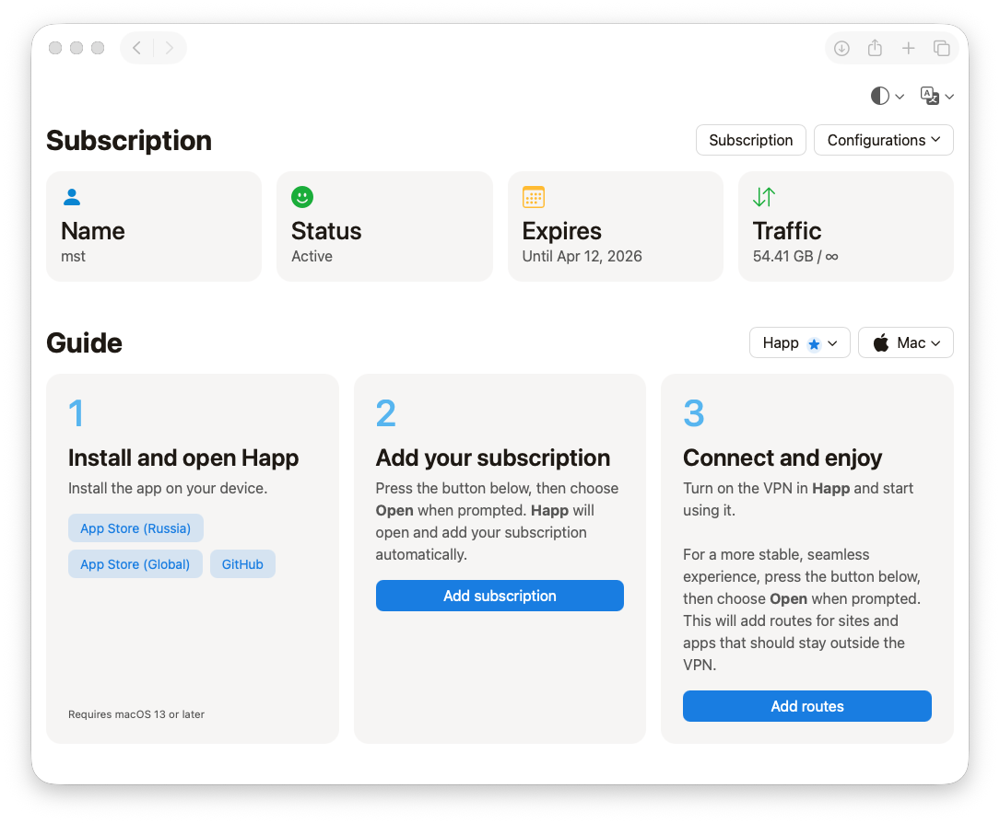

# Marzbanify Omni

<p align="center">
 <a href="./README.md">Русская версия</a>
  <br><br>
  <b>Marzbanify Omni</b> is a fork of <a href="https://github.com/dermv/marzbanify-template">Marzbanify Template</a>.
  <br><br>
  A simple, polished, and user-friendly HTML subscription page template for <a href="https://github.com/Gozargah/Marzban">Marzban</a> and <a href="https://github.com/PasarGuard/panel">PasarGuard</a>.
  <br><br>
  <a href="#why-this-fork-exists">Why this fork was created</a>
  ·
  <a href="#what-changed-in-this-fork">What has changed in this fork</a>
  <br>
  <a href="#install">Installation</a>
  ·
  <a href="#customization">Customization</a>
  ·
  <a href="#reference">Reference</a>
</p>

<p>
  <picture>
    <source media="(prefers-color-scheme: dark)" srcset="./screenshots/dark_en.png">
    <source media="(prefers-color-scheme: light)" srcset="./screenshots/light_en.png">
    
  </picture>
</p>

<a id="why-this-fork-exists"></a>
## Why this fork was created
The original templates were built around a narrow Hiddify-based connection flow. This fork was created to preserve the lightweight template approach while giving users a choice of **operating system + client app**, using modern and actively maintained clients instead of Hiddify, which is no longer updated. **Happ** is now the recommended default client for all devices, which is why it is marked with an asterisk in the interface. A separate adapted version has also been made for PasarGuard.

## Overview

Supported panels:

- `Marzban`
- `PasarGuard`

Each line includes two page variants:

- `index.html` — a full version with a subscription info block
- `mini/index.html` — a compact version without the subscription info block

Supported localizations:

- Russian
- English

<a id="what-changed-in-this-fork"></a>
## What has changed in this fork

Compared to the original [**Marzbanify Template**](https://github.com/dermv/marzbanify-template), this fork currently includes the following confirmed changes:

- The project now includes two separate versions of the page: one for Marzban and one for PasarGuard.
- The page now supports client app selection and shows setup instructions that match the selected app and platform.
- The supported operating systems now include `iOS`, `Android`, `Mac`, `Windows`, and `Linux`.
- The current variants use the following clients: `Happ`, `Incy`, `Shadowrocket`, `v2rayN`, `v2rayNG`, `Clash`, `Clash Meta`, `Outline`, and `Sing-Box`.
- The templates have been updated with new guide sections, subscription and config actions, and QR codes not only for subscriptions, but also for configurations supported by Marzban or PasarGuard, along with a newer header and menu structure.
- For **Happ** and **Incy**, support was added for local on-device routing via JSON sources from [**RoscomVPN**](https://github.com/hydraponique/roscomvpn-routing).
- The current interface variants now provide two locales: **Russian** and **English**.
- For PasarGuard, the subscription page supports copying configurations for compatible clients: `Clash`, `Clash Meta`, `Outline`, `Sing-Box`, and `Xray`. The visible client list depends on panel settings: if manual configurations are disabled, they are hidden on the subscription page as well.

## Supported variables

### Marzban

The template uses the following values, which must be provided by the panel:

- `{{ user.links }}`
- `{{ user.status.value }}`
- `{{ user.username }}`
- `{{ user.expire | datetime }}`
- `{{ user.used_traffic | bytesformat }}`
- `{{ user.used_traffic }}`
- `{{ user.data_limit | bytesformat }}`
- `{{ user.data_limit }}`
- `{{ user.data_limit_reset_strategy.value }}`

The mini version does not use the user summary fields. From the panel, it only needs the config list:

- `{{ user.links }}`

### PasarGuard

The full version uses the same summary placeholders:

- `{{ user.status.value }}`
- `{{ user.username }}`
- `{{ user.expire | datetime }}`
- `{{ user.used_traffic | bytesformat }}`
- `{{ user.used_traffic }}`
- `{{ user.data_limit | bytesformat }}`
- `{{ user.data_limit }}`
- `{{ user.data_limit_reset_strategy.value }}`

In addition, the template expects the current page URL to have this format:

- `/sub/<token>`

From that URL, the template builds these child endpoints:

- `/sub/<token>/links`
- `/sub/<token>/xray`
- `/sub/<token>/clash`
- `/sub/<token>/clash_meta`
- `/sub/<token>/outline`
- `/sub/<token>/sing_box`

The mini version does not use the user summary placeholders, but it relies on the same URL contract:

- `/sub/<token>`
- `/sub/<token>/links`
- `/sub/<token>/xray`
- `/sub/<token>/clash`
- `/sub/<token>/clash_meta`
- `/sub/<token>/outline`
- `/sub/<token>/sing_box`

<a id="customization"></a>
## Safe customization

Below are the configuration points that are actually present in the current HTML files and can be changed without altering the page architecture.

### Safe to edit

- `DEFAULT_THEME`
  The default theme: `system`, `light`, or `dark`.

- `META_THEME_COLORS`
  The `theme-color` values for light and dark themes.

- `SUBSCRIPTION_NAME`
  The name used in part of the client deep-link schemes.

- `ROUTING_PROFILE_URLS`
  The remote routing profile URLs for `Happ` and `Incy`.

- `ROUTING_PROFILE_FALLBACK_JSON`
  The built-in fallback routing profiles used when the remote JSON is unavailable.

- `GUIDE_APPS`
  The main guide configuration:
  available platforms, app list, `defaultApp`, `recommended`, `minOs`, install buttons, deep links, routing links, and, for PasarGuard, `configFormat`.

- `GUIDE_COPY`
  The step text for both locales.

- `MESSAGES`
  The interface text, button labels, modal text, and localization strings.

- `PASARGUARD_DOWNLOAD_FILENAMES`
  Only the download filename values in the PasarGuard templates. The format keys themselves should not be changed.

### Can be changed, but with care

- App store and GitHub release URLs inside `GUIDE_APPS`
- Install button labels
- Localized text inside `GUIDE_COPY` and `MESSAGES`

If you edit these values, keep the current object structure and key set intact.

## What should not be edited

### Do not edit unless necessary

- The panel Jinja placeholders:
  `{{ ... }}` and ``

- The PasarGuard URL contract:
  `/sub/<token>`, `/links`, `/xray`, `/clash`, `/clash_meta`, `/outline`, `/sing_box`

- The PasarGuard format keys:
  `xray`, `clash`, `clash_meta`, `outline`, `sing_box`

- The `id`, `data-*`, classes, and DOM structure used by the JavaScript

- The logic that reads `window.location.href`, `localStorage`, the routing profile cache, and panel-provided values

### Why this matters

In the current implementation, the JS depends on specific `id`s, `data-guide-platform`, `data-theme-val`, `data-locale`, panel template values, and a predictable menu and modal structure. Renaming these elements without updating the JS at the same time can break:

- theme and language switching
- platform and client menus
- deep-link generation
- the QR modal
- config loading
- routing profiles

<a id="install"></a>
## Installation for Marzban

### 1. Copy the file into the Marzban templates directory

Example for the full version:

```bash
sudo wget -O /var/lib/marzban/templates/subscription/index.html https://raw.githubusercontent.com/mrkstnn/marzbanify-omni/main/Marzban/index.html
```

Example for the mini version:

```bash
sudo wget -O /var/lib/marzban/templates/subscription/index.html https://raw.githubusercontent.com/mrkstnn/marzbanify-omni/main/Marzban/mini/index.html
```

### 3. Set the template path in the Marzban configuration

The repository uses the following variables for this:

```bash
CUSTOM_TEMPLATES_DIRECTORY="/var/lib/marzban/templates/"
SUBSCRIPTION_PAGE_TEMPLATE="subscription/index.html"
```

Example for adding them to `/opt/marzban/.env`:

```bash
echo 'CUSTOM_TEMPLATES_DIRECTORY="/var/lib/marzban/templates/"' | sudo tee -a /opt/marzban/.env
echo 'SUBSCRIPTION_PAGE_TEMPLATE="subscription/index.html"' | sudo tee -a /opt/marzban/.env
```

### 4. Restart Marzban

```bash
marzban restart
```

## Installation for PasarGuard

### 1. Copy the file into the PasarGuard templates directory

Example for the full version:

```bash
sudo wget -O /var/lib/pasarguard/templates/subscription/index.html https://raw.githubusercontent.com/mrkstnn/marzbanify-omni/main/PasarGuard/index.html
```

Example for the mini version:

```bash
sudo wget -O /var/lib/pasarguard/templates/subscription/index.html https://raw.githubusercontent.com/mrkstnn/marzbanify-omni/main/PasarGuard/mini/index.html
```

### 3. Set the template path in the PasarGuard configuration

The repository uses the following variables for this:

```bash
CUSTOM_TEMPLATES_DIRECTORY="/var/lib/pasarguard/templates/"
SUBSCRIPTION_PAGE_TEMPLATE="subscription/index.html"
```

Example for adding them to `/opt/pasarguard/.env`:

```bash
echo 'CUSTOM_TEMPLATES_DIRECTORY="/var/lib/pasarguard/templates/"' | sudo tee -a /opt/pasarguard/.env
echo 'SUBSCRIPTION_PAGE_TEMPLATE="subscription/index.html"' | sudo tee -a /opt/pasarguard/.env
```

### 4. Restart PasarGuard

```bash
pasarguard restart
```

<a id="reference"></a>
## Reference

Original project: [**Marzbanify Template**](https://github.com/dermv/marzbanify-template)

This fork should be viewed as a vibe-coding adaptation of the original project, rather than a fully independent rewrite from scratch.

The templates use external dependencies:

- Bootstrap CDN
- `qr-code-styling` CDN
- routing JSON from GitHub for `Happ` and `Incy`
- the PasarGuard templates also make runtime requests to format endpoints
